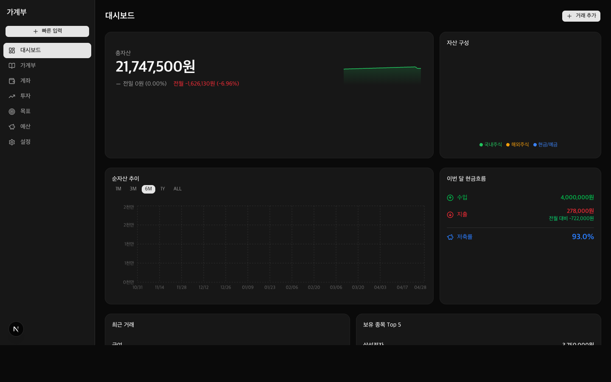
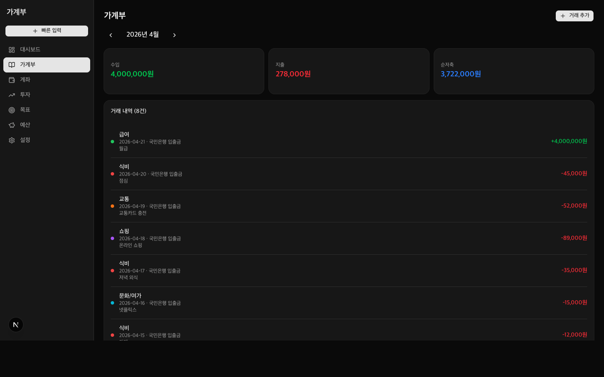
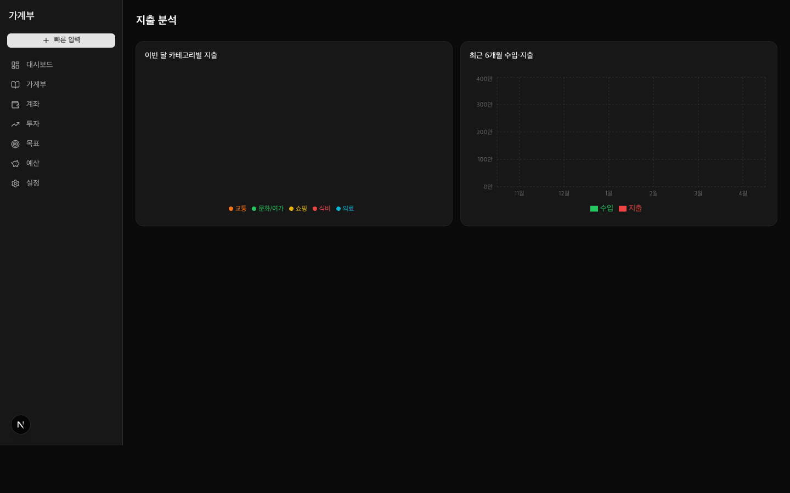
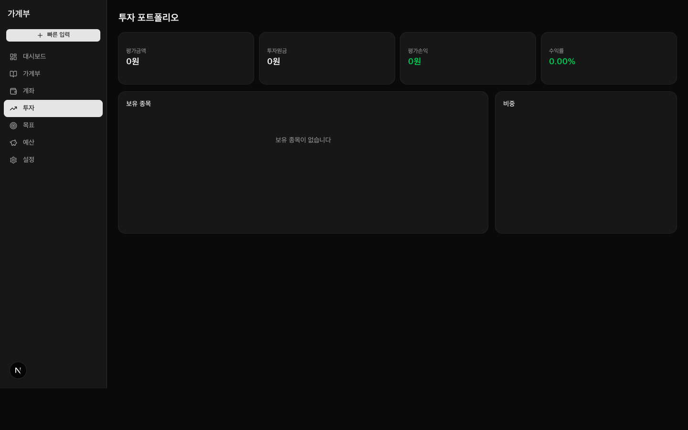
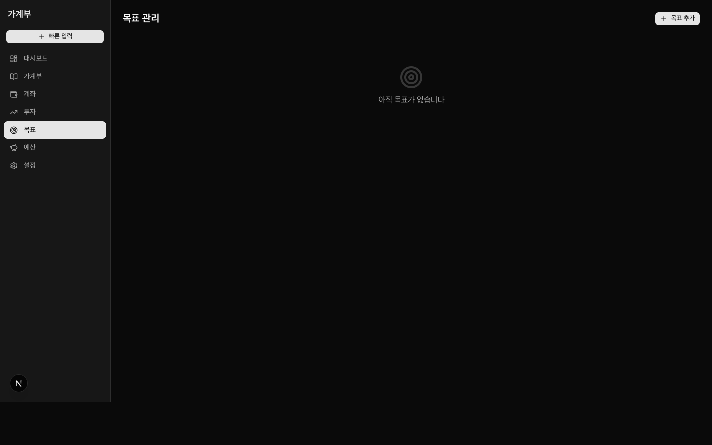

# 개인 가계부 & 투자 포트폴리오 관리 웹 애플리케이션

## 1. 문제 정의

### 배경
개인 자산을 한 곳에서 통합 관리하는 도구가 부재했다. 기존 은행 앱은 해당 기관의 계좌만 보여주고, 투자 앱은 종목 정보만 제공하며, 스프레드시트로 관리하면 실시간성이 없고 입력이 번거롭다.

### 핵심 문제
> **"지금 내 총자산이 얼마이고, 시간이 지나면서 어떻게 변해왔는가?"**

이 질문에 즉각 답해주는 통합 뷰가 없다.

### 해결 목표
- 현금/예금 계좌 + 국내·해외 주식 보유를 **단일 화면**에서 통합 조회
- 거래 입력 → 잔액 자동 반영 → 순자산 추이 시각화까지 **end-to-end 자동화**
- 카테고리별 지출 분석으로 **소비 패턴 인식**
- 재무 목표 설정 및 달성 진행률 추적

---

## 2. 데이터 & 도구 선정

### 기술 스택

| 분류 | 선택 | 이유 |
|------|------|------|
| Framework | Next.js 16 (App Router) | React Server Components + API Routes를 하나의 프로젝트에서 처리 |
| Language | TypeScript | 금융 데이터의 타입 안정성 확보 |
| Styling | Tailwind CSS + shadcn/ui | 다크모드 우선, 빠른 컴포넌트 조합 |
| 차트 | Recharts | React 친화적, 커스터마이징 용이 |
| 상태관리 | TanStack Query (React Query) | 서버 상태 캐싱, 자동 동기화 |
| 데이터 저장 | JSON 파일 (로컬) | 외부 DB 없이 즉시 실행, 데이터 export/import 용이 |
| 날짜 | date-fns | 경량, tree-shaking 지원 |
| 폼 | react-hook-form + zod | 선언적 유효성 검사 |

### 데이터 모델

```
data/
├── accounts.json          # 계좌 (현금/입출금/저축/증권)
├── transactions.json      # 수입·지출·이체 거래 내역
├── categories.json        # 카테고리 (식비, 교통, 급여 등)
├── holdings.json          # 보유 주식 종목
├── trades.json            # 매수·매도 내역
├── goals.json             # 재무 목표
├── budgets.json           # 카테고리별 예산
├── net_worth_snapshots.json  # 일별 순자산 스냅샷
└── exchange_rates.json    # 환율 (USD/KRW)
```

---

## 3. 구현

### 아키텍처

```
account-app/
├── app/
│   ├── page.tsx                        # 대시보드 (홈)
│   ├── transactions/page.tsx           # 가계부
│   ├── transactions/analytics/page.tsx # 지출 분석
│   ├── accounts/page.tsx               # 계좌 관리
│   ├── investments/page.tsx            # 투자 포트폴리오
│   ├── investments/trades/page.tsx     # 매매 내역
│   ├── goals/page.tsx                  # 목표 관리
│   ├── budget/page.tsx                 # 예산 관리
│   ├── settings/page.tsx               # 설정 (데이터 export/import, 환율)
│   └── api/                            # Next.js API Routes
│       ├── dashboard/route.ts
│       ├── transactions/route.ts
│       ├── accounts/route.ts
│       ├── holdings/route.ts
│       ├── snapshots/route.ts          # 순자산 스냅샷 자동 생성
│       └── data/export|import/route.ts
├── components/
│   ├── dashboard/                      # 대시보드 위젯
│   └── transactions/TransactionModal.tsx
├── lib/
│   ├── db.ts       # JSON 파일 읽기/쓰기
│   ├── calc.ts     # 총자산·평균단가 계산 로직
│   └── format.ts   # 금액·퍼센트 포맷 유틸
└── types/index.ts  # 전체 타입 정의
```

### 주요 코드

#### `lib/db.ts` — JSON 기반 데이터 레이어
```typescript
import fs from 'fs'
import path from 'path'

const DATA_DIR = path.join(process.cwd(), 'data')

export function readJson<T>(filename: string, defaultValue: T): T {
  const filepath = path.join(DATA_DIR, filename)
  if (!fs.existsSync(filepath)) return defaultValue
  try {
    return JSON.parse(fs.readFileSync(filepath, 'utf-8')) as T
  } catch {
    return defaultValue
  }
}

export function writeJson<T>(filename: string, data: T): void {
  const filepath = path.join(DATA_DIR, filename)
  fs.writeFileSync(filepath, JSON.stringify(data, null, 2), 'utf-8')
}
```

#### `lib/calc.ts` — 총자산 계산 및 평균매입단가 산출
```typescript
export function calcTotalAssets(accounts, holdings, exchangeRates) {
  const usdRate = exchangeRates.find(r => r.currency === 'USD')?.rate ?? 1300

  let cash = 0, other = 0
  for (const acc of accounts) {
    const balanceKRW = acc.currency === 'USD' ? acc.balance * usdRate : acc.balance
    if (['cash', 'checking', 'savings'].includes(acc.type)) cash += balanceKRW
    else if (acc.type === 'other') other += balanceKRW
  }

  let stockKr = 0, stockUs = 0
  for (const h of holdings) {
    const valueKRW = h.currency === 'USD'
      ? h.currentPrice * h.quantity * usdRate
      : h.currentPrice * h.quantity
    if (['KOSPI', 'KOSDAQ'].includes(h.market)) stockKr += valueKRW
    else stockUs += valueKRW
  }

  return { total: cash + stockKr + stockUs + other, cash, stockKr, stockUs, other }
}

// 매수/매도 이력으로 평균단가 자동 계산
export function calcAvgPrice(trades) {
  let quantity = 0, totalCost = 0
  for (const trade of trades) {
    if (trade.type === 'buy') {
      totalCost += trade.quantity * trade.price
      quantity += trade.quantity
    } else {
      const ratio = trade.quantity / quantity
      totalCost -= totalCost * ratio
      quantity -= trade.quantity
    }
  }
  return { avgPrice: quantity > 0 ? totalCost / quantity : 0, quantity: Math.max(0, quantity) }
}
```

#### `app/api/dashboard/route.ts` — 대시보드 통합 API
```typescript
export async function GET() {
  const accounts     = readJson<Account[]>('accounts.json', [])
  const transactions = readJson<Transaction[]>('transactions.json', [])
  const holdings     = readJson<Holding[]>('holdings.json', [])
  const snapshots    = readJson<NetWorthSnapshot[]>('net_worth_snapshots.json', [])
  const exchangeRates = readJson<ExchangeRate[]>('exchange_rates.json', [])

  const breakdown = calcTotalAssets(accounts, holdings, exchangeRates)
  const thisMonth = format(new Date(), 'yyyy-MM')

  const thisMonthTxs = transactions.filter(t => t.date.startsWith(thisMonth))
  const monthlyIncome  = thisMonthTxs.filter(t => t.type === 'income').reduce((s,t) => s + t.amount, 0)
  const monthlyExpense = thisMonthTxs.filter(t => t.type === 'expense').reduce((s,t) => s + t.amount, 0)
  const savingsRate = monthlyIncome > 0 ? ((monthlyIncome - monthlyExpense) / monthlyIncome) * 100 : 0

  return NextResponse.json({
    totalAssets: breakdown.total,
    assetBreakdown: breakdown,
    monthlyIncome, monthlyExpense, savingsRate,
    recentTransactions: transactions.sort(...).slice(0, 5),
    topHoldings: holdings.sort((a,b) => b.valueKRW - a.valueKRW).slice(0, 5),
    snapshots: recentSnapshots,
    ...
  })
}
```

#### `app/api/snapshots/route.ts` — 일별 순자산 자동 스냅샷
```typescript
export async function POST() {
  const today = new Date().toISOString().split('T')[0]
  const snapshots = readJson<NetWorthSnapshot[]>('net_worth_snapshots.json', [])

  // 하루에 한 번만 생성 (앱 진입 시 자동 호출)
  const existing = snapshots.find(s => s.date === today)
  if (existing) return NextResponse.json(existing)

  const snapshot = createSnapshot(accounts, holdings, exchangeRates, today, uuidv4())
  snapshots.push(snapshot)
  writeJson('net_worth_snapshots.json', snapshots)
  return NextResponse.json(snapshot, { status: 201 })
}
```

#### `app/api/transactions/route.ts` — 거래 CRUD
```typescript
export async function GET(req: Request) {
  const { searchParams } = new URL(req.url)
  const month = searchParams.get('month')  // YYYY-MM 필터

  let txs = readJson<Transaction[]>('transactions.json', [])
  if (month) txs = txs.filter(t => t.date.startsWith(month))
  txs.sort((a, b) => b.date.localeCompare(a.date))
  return NextResponse.json(txs)
}

export async function POST(req: Request) {
  const body = await req.json()
  const newTx: Transaction = {
    id: uuidv4(),
    date: body.date,
    accountId: body.accountId,
    type: body.type,           // 'income' | 'expense' | 'transfer'
    categoryId: body.categoryId,
    amount: body.amount,
    memo: body.memo ?? '',
    createdAt: new Date().toISOString(),
  }
  const txs = readJson<Transaction[]>('transactions.json', [])
  txs.push(newTx)
  writeJson('transactions.json', txs)
  return NextResponse.json(newTx, { status: 201 })
}
```

#### `lib/format.ts` — 금액 표시 유틸 (전역 통일)
```typescript
export function formatCurrency(amount: number, currency: 'KRW' | 'USD' = 'KRW', usdRate?: number): string {
  if (currency === 'KRW') return `${Math.round(amount).toLocaleString('ko-KR')}원`
  const usdStr = `$${amount.toLocaleString('en-US', { minimumFractionDigits: 2 })}`
  if (usdRate) return `${usdStr} (₩${Math.round(amount * usdRate).toLocaleString('ko-KR')})`
  return usdStr
}

export function formatKRW(amount: number): string {
  return `${Math.round(amount).toLocaleString('ko-KR')}원`
}

export function formatPercent(value: number): string {
  return `${value > 0 ? '+' : ''}${value.toFixed(2)}%`
}

export function formatChange(value: number): string {
  return `${value > 0 ? '+' : ''}${Math.round(value).toLocaleString('ko-KR')}원`
}
```

---

## 4. 실행 방법

```bash
# 의존성 설치
npm install

# 개발 서버 실행
npm run dev

# 브라우저에서 접속
open http://localhost:3000
```

> **데이터 초기화 (샘플 데이터 생성)**
> ```bash
> npm run seed
> ```

---

## 5. 결과물

### 화면 구성 (9개 페이지)

| 경로 | 설명 |
|------|------|
| `/` | 대시보드 — 총자산, 자산 구성 파이차트, 순자산 추이, 현금흐름 요약 |
| `/transactions` | 가계부 — 월별 거래 내역, 수입/지출/저축 요약 |
| `/transactions/analytics` | 지출 분석 — 카테고리 파이차트, 월별 수입·지출 추이 |
| `/accounts` | 계좌 관리 — 계좌 CRUD |
| `/investments` | 투자 포트폴리오 — 보유 종목, 평가손익, 비중 차트 |
| `/investments/trades` | 매매 내역 — 매수·매도 기록, 평균단가 자동 계산 |
| `/goals` | 목표 관리 — 재무 목표 설정 및 진행률 |
| `/budget` | 예산 관리 — 카테고리별 월 예산 |
| `/settings` | 설정 — 데이터 JSON export/import, 환율 수동 입력 |

### 스크린샷

#### 대시보드


총자산(21,747,500원) 카드에 전일·전월 대비 증감, 스파크라인 차트, 자산 구성 파이차트(국내주식/해외주식/현금), 6개월 순자산 추이 라인차트, 이번 달 현금흐름(저축률 93.0%) 표시.

#### 가계부


월별 수입·지출·순저축 요약 카드, 거래 내역 리스트 (카테고리 색상·날짜·계좌·메모 표시), 거래 추가/수정/삭제 지원.

#### 지출 분석


이번 달 카테고리별 지출 파이차트, 최근 6개월 수입·지출 막대그래프.

#### 투자 포트폴리오


평가금액·투자원금·평가손익·수익률 요약 카드, 보유 종목 테이블, 비중 파이차트.

#### 목표 관리


재무 목표 추가 및 진행률 추적.

### 주요 구현 포인트

1. **순자산 스냅샷 자동 생성**: 앱 진입 시 `POST /api/snapshots`가 호출되어 오늘자 스냅샷이 없으면 자동 생성. 이를 바탕으로 순자산 추이 차트를 그림.

2. **다중 통화 지원**: 해외 주식(USD) 보유 종목을 환율로 원화 환산하여 총자산에 합산. `calcTotalAssets()`이 계좌와 종목을 통합 계산.

3. **평균단가 자동 계산**: 매수·매도 이력을 누적하여 `calcAvgPrice()`로 가중평균 단가와 현재 보유 수량 산출.

4. **JSON Export/Import**: DB 없이 로컬 JSON 파일로 데이터를 관리하므로 설정 페이지에서 전체 데이터를 단일 JSON으로 내보내고 복원 가능.

5. **다크모드 기본**: `next-themes`로 시스템 설정 연동, 토글 지원.

6. **TanStack Query 캐싱**: 거래 추가/삭제 후 `invalidateQueries`로 대시보드·거래 목록을 자동 갱신.

---

## 6. 타입 정의 (전체 데이터 모델)

```typescript
// types/index.ts

export interface Account {
  id: string; name: string
  type: 'cash' | 'checking' | 'savings' | 'stock_kr' | 'stock_us' | 'other'
  currency: 'KRW' | 'USD'; balance: number; createdAt: string
}

export interface Transaction {
  id: string; date: string; accountId: string
  type: 'income' | 'expense' | 'transfer'
  categoryId: string; amount: number; memo: string; createdAt: string
}

export interface Holding {
  id: string; name: string; ticker: string
  market: 'KOSPI' | 'KOSDAQ' | 'NYSE' | 'NASDAQ' | 'OTHER'
  currency: 'KRW' | 'USD'
  quantity: number; avgPrice: number; currentPrice: number
}

export interface NetWorthSnapshot {
  id: string; date: string  // YYYY-MM-DD
  totalAssets: number; totalLiabilities: number; netWorth: number
  breakdown: { cash: number; stockKr: number; stockUs: number; other: number }
}
```
